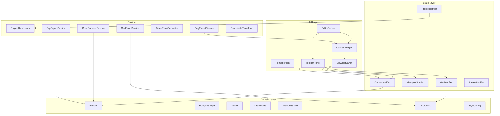
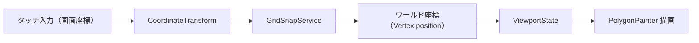
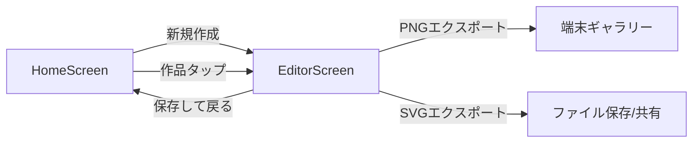
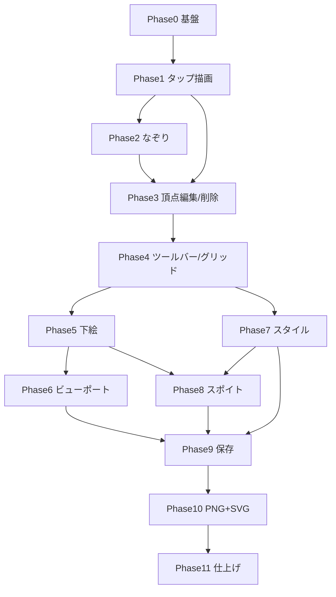

# polygon_art_app 開発計画

## 現状

- [pubspec.yaml](f:\polygon_art_app\pubspec.yaml): Flutter SDK `^3.12.2`、依存はデフォルトのみ
- [lib/main.dart](f:\polygon_art_app\lib\main.dart): カウンターアプリのテンプレート
- Android 設定: [AndroidManifest.xml](f:\polygon_art_app\android\app\src\main\AndroidManifest.xml) に権限未設定

## 最終形態の機能一覧

| カテゴリ | 機能 |
|---------|------|
| 描画 | タップモード / なぞりモード（等間隔点）、手動ポリゴン閉じ |
| 編集 | 頂点の長押しドラッグ移動、**頂点の個別選択・削除** |
| 下絵 | 画像取込、不透明度調整、**スポイト（自動色取得）** |
| キャンバス | 2本指ピンチズーム・平行移動、**グリッド表示・スナップ** |
| スタイル | 単色 / グラデーション、パレット |
| 保存 | アプリ内 JSON 保存・再編集 |
| 出力 | PNG（ギャラリー）、**SVG（拡大しても劣化しないベクター出力）** |

## 技術方針

| 項目 | 方針 |
|------|------|
| プラットフォーム | Android のみ（iOS フォルダは残してよいが対象外） |
| 状態管理 | **Riverpod** |
| 描画 | `CustomPainter` + `RepaintBoundary`（PNG エクスポート用） |
| 座標系 | 頂点は**ワールド座標**で保存。表示・入力時にビューポート変換を適用 |
| 永続化 | アプリ内ドキュメントに JSON ファイル（1作品 = 1ファイル） |
| ポリゴン確定 | **手動閉じ**（最初の点付近タップ or 「閉じる」ボタン） |
| キャンバス操作 | **2本指**でピンチズーム + 平行移動 |
| スナップ | グリッド間隔はワールド座標基準。頂点追加・移動・なぞり生成点に適用 |
| SVG 出力 | ポリゴンパスを `<polygon>` / `<path>` として生成（ラスター非依存） |

### 推奨パッケージ（段階的に追加）

```yaml
# Phase 1-2
flutter_riverpod: ^2.x
uuid: ^4.x

# Phase 5, 8
image_picker: ^1.x
image: ^4.x              # 下絵ピクセル読み取り（スポイト）
permission_handler: ^11.x

# Phase 7
shared_preferences: ^2.x
flutter_colorpicker: ^1.x  # 任意

# Phase 9
path_provider: ^2.x

# Phase 10
gal: ^2.x                # PNG ギャラリー保存
share_plus: ^10.x        # SVG ファイル共有（任意）
```

---

## アーキテクチャ概要



### 推奨ディレクトリ構成

```
lib/
  main.dart
  app.dart
  models/
    vertex.dart
    polygon_shape.dart
    artwork.dart
    draw_mode.dart           # tap, trace, eyedropper, pan（任意）
    viewport_state.dart
    grid_config.dart         # spacing, visible, snapEnabled
    style_config.dart
    fill_style.dart
  providers/
    canvas_provider.dart
    viewport_provider.dart
    grid_provider.dart
    project_provider.dart
    palette_provider.dart
  services/
    project_repository.dart
    png_export_service.dart
    svg_export_service.dart
    color_sampler_service.dart   # スポイト
    grid_snap_service.dart
    trace_point_generator.dart
    coordinate_transform.dart
  screens/
    home_screen.dart
    editor_screen.dart
  widgets/
    canvas/
      polygon_canvas.dart
      polygon_painter.dart
      grid_painter.dart
      viewport_gesture_layer.dart
    toolbar/
      mode_switch.dart
      color_picker_panel.dart
      style_panel.dart
      grid_panel.dart
      viewport_controls.dart
      eyedropper_preview.dart
    common/
      artwork_card.dart
```

---

## 座標系とビューポート設計（横断的に重要）



| 概念 | 説明 |
|------|------|
| ワールド座標 | 作品の論理キャンバス上の固定座標。JSON・SVG エクスポートの基準 |
| ビューポート | 表示用 scale + translation。UI 状態のみ（保存しない） |
| グリッド | ワールド座標上の等間隔マス目。表示とスナップに共用 |
| 入力変換 | タップ → ワールド座標 →（スナップ ON 時）グリッド吸着 → 点追加 |

**保存方針**: ビューポートは作品データに含めない。グリッド設定（間隔・表示/スナップ ON/OFF）は作品ごとに JSON 保存可。

---

## ジェスチャー・モード設計（最終形態）

| モード / 操作 | 1本指 | 2本指 |
|--------------|-------|-------|
| **タップモード** | 短タップ: 点追加 / 頂点選択 | ピンチ: ズーム / ドラッグ: パン |
| **なぞりモード** | ドラッグ: 等間隔点生成 | 同上 |
| **スポイトモード** | タップ: 下絵から色取得 → 塗り色に適用 | 同上 |
| **全モード共通** | 長押し+ドラッグ: 頂点移動 | 描画操作を中断してビューポート操作 |

**頂点削除 UI**: 頂点をタップで選択 → ツールバー「頂点削除」ボタン（または選択頂点上的 Delete アイコン）

---

## フェーズ別実装ステップ

### Phase 0: プロジェクト基盤（1日目）

**目的**: テンプレートをアプリ骨格に置き換える

- Riverpod エントリポイント、`app.dart`、Home / Editor 画面骨格
- AndroidManifest 権限の準備（コメント付き）

**完了条件**: `flutter run` で Home → Editor に遷移できる

---

### Phase 1: 描画コア — タップモード（2〜3日目）

**目的**: 点を打ってポリゴンを描ける最小 MVP

```dart
class Vertex { String id; Offset position; }  // ワールド座標
class PolygonShape {
  List<Vertex> vertices;
  Color fillColor;
  Color strokeColor;
  double strokeWidth;
  FillStyle fillStyle;       // Phase 7
}
class Artwork {
  String id;
  String title;
  Size canvasSize;
  List<PolygonShape> polygons;
  List<Vertex> draftVertices;
  GridConfig gridConfig;     // Phase 4 で使用
}
```

- `PolygonPainter` + タップで点追加 → 手動閉じ
- 座標は最初からワールド座標で記録

**完了条件**: タップで複数ポリゴンを描き、色付きで表示できる

---

### Phase 2: なぞりモード — 等間隔点自動配置（2日目）

- `TracePointGenerator` でパス上を等間隔サンプリング
- `DrawMode.tap` / `DrawMode.trace` 切替

**完了条件**: なぞりで等間隔の頂点列が生成される

---

### Phase 3: 頂点編集 — 選択・移動・個別削除（2日目）【拡張】

**目的**: 配置済み頂点を選択して微調整・削除できる

#### 頂点選択

- 短タップで半径 N px 以内の最近傍頂点を選択（確定前 `draftVertices` / 確定後 `PolygonShape.vertices` 両方）
- 選択中の頂点をハンドル（強調色の円）で表示
- キャンバス空白タップで選択解除

#### 長押し + ドラッグ移動

- 長押し開始時に頂点を選択し、ドラッグで `position` 更新
- スナップ有効時は `GridSnapService.snap()` を適用（Phase 4 以降）

#### 個別削除

- 選択中の頂点に対し、ツールバー「頂点削除」ボタンで削除
- **削除後のポリゴン処理ルール**:
  - 残り頂点が **3 点以上** → ポリゴンとして維持
  - 残り頂点が **2 点以下** → ポリゴンを解消し、残点を `draftVertices` に移す（再編集可能に）
- Undo / Redo 対応

**完了条件**: 頂点を選択・移動・個別削除でき、ポリゴン形状が正しく更新される

---

### Phase 4: エディタ UI・Undo/Redo・グリッド（2日目）【拡張】

**目的**: 実用レベルの編集 UI と幾何学的補助機能

#### ツールバー

- モード切替（タップ / なぞり）
- 色選択、線幅、なぞり間隔
- Undo / Redo
- **グリッド ON/OFF**、**スナップ ON/OFF**
- **グリッド間隔**スライダー（例: 8〜64 px、ワールド座標）

#### グリッド表示

```dart
class GridConfig {
  bool visible;
  bool snapEnabled;
  double spacing;   // ワールド座標 px
}
```

- `GridPainter`: ビューポート変換後のキャンバス上にマス目を描画（主グリッド / 副グリッド）
- ズーム倍率に応じて描画密度を調整（極端な拡大時の描画負荷を抑制）

#### スナップ

- `GridSnapService.snap(Offset world, GridConfig)` → 最近傍グリッド交点に吸着
- 適用タイミング: 点追加、なぞり生成点、頂点ドラッグ移動
- スナップ OFF 時は生のワールド座標を使用

**完了条件**: グリッド表示・スナップが動作し、主要操作がツールバーから完結する

---

### Phase 5: 下絵（背景画像）取り込み（2日目）

- `image_picker` でギャラリーから画像選択
- `Artwork` に `backgroundImagePath`, `backgroundOpacity` を追加
- `CanvasLayout` で下絵と頂点の座標系を統一
- 下絵画像を `image` パッケージでデコードし、Phase 8 スポイト用にメモリキャッシュ

**完了条件**: 写真を背景に載せ、その上にポリゴンを描ける

---

### Phase 6: キャンバスビューポート — ピンチズーム・平行移動（2〜3日目）

- 2本指ピンチ（拡大/縮小）+ 2本指ドラッグ（平行移動）
- `CoordinateTransform` で全入力をワールド座標に変換
- 「全体表示に戻す」、倍率表示

**完了条件**: 2本指操作でズーム/パンでき、1本指の描画・編集が正常動作する

---

### Phase 7: スタイル拡張 — グラデーション・パレット（2〜3日目）

- `FillStyle`: 単色 / 線形グラデ / 放射グラデ
- `PaletteNotifier` + `SharedPreferences` でパレット永続化
- スポイトで取得した色をパレット MRU に自動追加（Phase 8 連携）

**完了条件**: グラデーション付きポリゴンが描け、パレットから色を選べる

---

### Phase 8: スポイト（自動色取得）機能（2日目）【新規】

**目的**: 下絵のタップ位置から色を取得し、ポリゴンの塗り色に適用

#### モード

- `DrawMode.eyedropper` をツールバーに追加
- 下絵未設定時はモードを無効化（グレーアウト + 説明）

#### 色取得

- `ColorSamplerService`
  1. タップ位置（ワールド座標）→ 下絵画像上のピクセル座標に変換（`CanvasLayout` 逆算）
  2. `image` パッケージで `(x, y)` の RGBA を取得
  3. 取得色を `currentFillColor` にセット
- オプション: 選択中ポリゴンがある場合はその `fillColor` を直接更新

#### UI

- スポイトモード中: タップ位置にサークルカーソル + 取得色プレビュー（`eyedropper_preview.dart`）
- ツールバーに取得色チップを表示
- 取得後は自動でタップモードに戻る（またはスポイトモード継続を設定で選択）

**完了条件**: 下絵上をタップして色を取得し、次に描くポリゴン（または選択ポリゴン）に適用できる

---

### Phase 9: アプリ内保存・作品一覧（2〜3日目）

- `ProjectRepository`: JSON 保存（頂点・色・グラデーション・グリッド設定・下絵パス）
- `HomeScreen`: サムネイル付き作品グリッド、新規 / 再開 / 削除
- 編集画面離脱時の自動保存

**完了条件**: 作品を保存・一覧表示・再開・削除できる

---

### Phase 10: エクスポート — PNG + SVG（2〜3日目）【拡張】

**目的**: ラスター（ギャラリー）とベクター（拡大劣化なし）の両方で出力

#### PNG エクスポート（既存）

- `PngExportService`: ビューポート非適用、ワールド座標で全キャンバスを `RepaintBoundary.toImage()` レンダリング
- 下絵を含む/含まない、解像度（1x / 2x / 3x）選択
- `gal.putImageBytes(...)` でギャラリー保存

#### SVG エクスポート（新規）

- `SvgExportService`: ポリゴンデータから SVG XML を生成

```xml
<svg xmlns="http://www.w3.org/2000/svg"
     viewBox="0 0 {canvasWidth} {canvasHeight}">
  <defs><!-- linearGradient / radialGradient --></defs>
  <!-- 下絵: 任意で <image href="data:image/jpeg;base64,..."/> -->
  <polygon points="x1,y1 x2,y2 ..." fill="#RRGGBB" stroke="#RRGGBB" stroke-width="N"/>
</svg>
```

- グラデーション: SVG `<defs>` 内に `<linearGradient>` / `<radialGradient>` を出力
- 下絵: エクスポート設定で「下絵を SVG に含める」ON/OFF（含める場合は base64 埋め込み）
- 保存先: アプリ内ドキュメント + `share_plus` でファイル共有、または Downloads フォルダへ保存
- **PNG との使い分け**: PNG = SNS/ギャラリー共有、SVG = 印刷・拡大・外部編集（Illustrator 等）

**完了条件**: PNG がギャラリーに、SVG がファイルとして保存/共有可能（ズーム状態に非依存）

---

### Phase 11: 仕上げ・品質向上（2〜3日目）

- 空キャンバス警告、未保存変更の確認ダイアログ
- ポリゴン全体の選択・削除
- パフォーマンス最適化（高倍率時のグリッド間引き、下絵キャッシュ）
- テスト: `TracePointGenerator`, `GridSnapService`, `CoordinateTransform`, `SvgExportService`, JSON シリアライズ
- アプリ名・アイコン・スプラッシュ更新

**完了条件**: 全機能が実機 Android で途切れず動作する

---

## 画面遷移



---

## 開発順序の依存関係



**依存の要点**

- **頂点削除** → Phase 3（描画コア直後。選択基盤を Phase 3 で構築）
- **グリッド** → Phase 4（描画コア完成後。スナップは Phase 3 移動にも後から効く）
- **スポイト** → Phase 8（Phase 5 下絵 + Phase 7 色体系の後）
- **SVG** → Phase 10（保存データが揃った後。FillStyle 定義が必要）

---

## 最初のスプリント（推奨着手順）

1. **Phase 0〜1** — 骨格 + タップ描画
2. **Phase 2〜3** — なぞり + 頂点選択/移動/削除
3. **Phase 4** — ツールバー + グリッド/スナップ
4. **Phase 5〜6** — 下絵 + ビューポート（なぞり UX の核）
5. **Phase 7〜8** — スタイル + スポイト
6. **Phase 9〜10** — 保存 + PNG/SVG エクスポート

---

## リスクと対策

| リスク | 対策 |
|--------|------|
| ジェスチャー競合（描画 vs ズーム/パン vs スポイト） | モードで 1 本指操作を明示的に切替。2 本指は常にビューポート |
| 座標変換バグ（ズーム/下絵/スポイトでずれる） | `CanvasLayout` + `CoordinateTransform` を 1 箇所に集約、テストで検証 |
| 頂点削除でポリゴンが壊れる | 3 点未満でポリゴン解消ルールを固定。Undo 必須 |
| スポイトの色ずれ（不透明度・圧縮） | 下絵は原画像ファイルから直接ピクセル取得。表示 opacity はサンプリングに影響させない |
| SVG グラデーション互換性 | 線形/放射のみサポート。複雑な FillStyle は SVG 出力時に単色フォールバック |
| SVG ファイルサイズ（下絵 base64） | 下絵埋め込みはデフォルト OFF。必要時のみ選択 |
| 高倍率時のグリッド描画負荷 | ズームに応じてグリッド線の描画間隔を間引く |

---

## 見積もり（目安）

| フェーズ | 期間目安 |
|---------|---------|
| Phase 0〜3（描画コア + 頂点編集） | 1〜1.5 週間 |
| Phase 4〜6（UI・グリッド・下絵・ビューポート） | 1.5 週間 |
| Phase 7〜8（スタイル・スポイト） | 1 週間 |
| Phase 9〜11（保存・エクスポート・仕上げ） | 1〜1.5 週間 |
| **合計** | **約 4.5〜5 週間**（1人・パートタイム想定）
