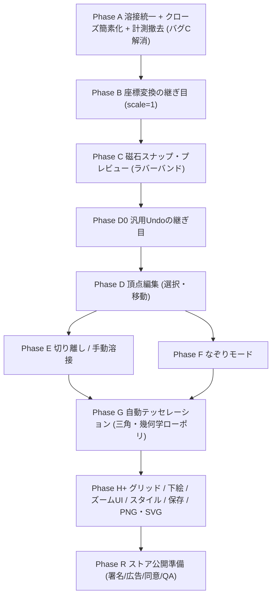

# polygon_art_app 開発計画（再設計版）

> リリース予定: 本アプリは **Google Play で正式リリース予定**。したがって「とりあえず動く」ではなく、拡張性・保守性・製品品質（下記「リリース要件」）を満たす前提で実装する。収益化は **広告のみ**（v1 はバナー最小、リリース後にリワードで解放）。**課金（IAP）は現時点では実装しないが、将来追加できる可能性は残す**（エンタイトルメントの継ぎ目を汎用に作る）。

実機テストで方針が当初計画からズレたため、コアを組み直す。この計画は既存の [.cursor/plans/polygon_art_開発計画_a355081f.plan.md](.cursor/plans/polygon_art_開発計画_a355081f.plan.md) を上書きする最新版。

> **本ファイルの運用ルール**: 議論の経緯・決定理由は末尾の「検討メモ」に日付付きで積み上げていく（履歴はここが正本）。単純な情報追加は各 Phase の節に直接追記してよい。既存の決定そのものを明確に覆す場合のみ、その行を削除せず ~~取り消し線~~ を引いて残し、検討メモの該当日付エントリを参照させる。関連する検討メモがある Phase の節には「→ 検討メモ（日付）参照」の一行リンクを添える。

## 確定した設計判断（前提）

- 目的: 絵が苦手な人でも「それっぽい」ポリゴンアートが作れる（点打ち／なぞり／〇→自動分割）。下絵をなぞって隙間なく敷き詰め、後から座標編集できる。
- データモデル: 重なる点は同じ `Vertex` を共有する「溶接（weld）」に一本化。描画・クローズ・磁石吸着すべて「近い既存頂点の ID を再利用」。
  - 「描画は ID 共有／クローズは座標コピー」という現行の非対称ルールは廃止。
- 切り離し（detach）は後フェーズで専用機能として追加（既定は溶接）。
- 座標変換の「継ぎ目」を前倒し（拡大率=1 で先に土台だけ）。当たり判定半径は画面 px を `/scale` してワールド換算。
- 自動テッセレーション: 三角メッシュのみ・既定は幾何学ローポリ。点分布は差し替え可能な部品にして、均一モザイクや四角は将来オプション。一つずつ実装。

## 戻りを最小化する実装順序

---

## リリース要件（横断・製品化）

機能フェーズ（A〜G）と並行して満たす、製品として出すための横断要件。★は「後から入れると作り直しになる」ため早期に土台を用意する。

- データ範囲: 作品データは**端末内のみ・アカウント無し・自前クラウド無し**。SNS共有は OS の共有シート経由で書き出し画像（PNG/SVG）を渡すだけ（`share_plus`）。あなた側の通信は**広告のためだけ**。
- ★保存の互換性: 保存JSONに `schemaVersion` を持たせ、`v1→v2…` のマイグレーション関数を用意。フェーズで項目が増えても**旧作品を壊さない**。最初の保存実装から入れる。
- ★Undo/Redo: 機能ごとに個別実装せず、**汎用の履歴スタック**で一元化（現在の `undoLastVertex` を置き換え/内包）。基本の継ぎ目（Undoのみ・スナップショット方式）は Phase D0 で前倒し、Redoと永続化統合は Phase H+ で追加。
- ★自動保存・復帰: デバウンス自動保存＋アプリ休止時保存＋アトミック書き込み（temp→rename）で、kill されても作品を失わない。
- 性能予算: テッセレーションで三角形が数千枚になり得るため、描画と当たり判定（現在は全頂点 O(n) 走査）の負荷を監視。必要になれば空間インデックス導入を検討（頭出し）。
- 収益化（広告のみ）:
  - v1 は **AdMob バナーのみ**（ホーム／作品一覧に配置、**キャンバス上には出さない**）。開発中はテスト広告ID、本番で本ID。
  - リリース後に **リワード広告で解放**（保存スロット追加／エクスポート解放）。
  - **エンタイトルメント（無料上限・解放状態・エクスポートtier）を汎用の継ぎ目として v1 で用意**。将来 IAP を足す余地を残す（今回は未実装）。
- 保存スロット/エクスポートの方針:
  - 無料の保存枚数は **10 枚**。上限到達時はギャラリーで「消して空ける」。リリース後にリワードでスロット追加。
  - 無料エクスポートは標準PNG。**プレミアム（透かし無し／高解像度／SVG）はリリース後にリワードで解放**。無料エクスポートに透かしを入れるかは Phase H のエクスポート実装時に決定。
  - 後から上限を締めると反発を招くため**上限モデルは今固定**。既存の保存済み作品は後の仕様変更でロックしない（救済）。
- コンプライアンス（広告に伴い必須）: プライバシーポリシー公開、Play「データ安全」申告（広告SDKの収集内容）、EEA/UK向け同意（Google UMP）、対象年齢は一般向け（13歳以上）。

## Phase A: 溶接統一・クローズ簡素化・計測撤去（バグC解消）

対象: [lib/providers/canvas_provider.dart](lib/providers/canvas_provider.dart)

核心: 単発タップの吸着（`findPolygonVertexNear` → `snapDraftEndToExistingVertex`、ID 再利用）は既に溶接として正しく動く。だから **ダブルタップは「再探索せず、そのまま閉じるだけ」** にする。これがバグCの根治。

- `handleDrawTap` のダブルタップ分岐（現 195-197 行）を、`_closeDraftNear` 呼び出しから直接 `closePolygon(fillColor)` に置換する。
  - 理由: 双子タップの1回目が最終頂点を配置（必要なら既存頂点へ溶接）済み。2回目は「閉じる合図」なので、undo も再探索も不要。2回目座標での再探索がバグCの原因だった。
- `_closeDraftNear`（316-384 行）を削除。
- `_lastTapInsertedCount` フィールドと関連ロジック（クローズの undo 用）を削除。`_isPseudoDoubleTap` は時間・距離判定のみ残す（`_lastTapAt` / `_lastTapPosition` は維持）。
- 計測コード一式を撤去: `// #region agent log` 〜 `// #endregion` のブロック全て、`_debugLog`、`_debugPosOf`、`import 'dart:convert'`、`import 'dart:io'`。
- ドックの整合性: `handleDrawTap` / `_handleSingleDrawTap` / `_isPseudoDoubleTap` / `closePolygon` のドキュメントコメントを、非対称ルール廃止・クローズ簡素化に合わせて更新。`findPolygonVertexNear` の「描画時は自分の点に吸着しない（draft 除外）」挙動は維持（自己交差防止のため正しい）。
- テスト更新: [test/canvas_notifier_test.dart](test/canvas_notifier_test.dart) の pseudo double-tap 系テストを新仕様（ダブルタップ=そのまま閉じる／座標コピーではなく既存 ID 溶接を検証）に書き換え。
- 補足確認: Glob 上 `lib/providers/canvas_provider.dart` がパス区切り差で二重表示された。実体が1ファイルであることを確認し、重複ファイルがあれば削除。

完了条件: `flutter analyze` / `flutter test` パス。実機で「B の終点を A の頂点付近に置いてダブルタップ→A に溶接して閉じる（始点に戻らない）」。

---

## Phase B: 座標変換の継ぎ目（拡大率=1 で先行）

目的: 後からピンチズームを足しても描画・スナップ・編集を書き直さない土台。

- `lib/services/coordinate_transform.dart` を新設: `scale` + `offset` を持つ `ViewportTransform`、`screenToWorld(Offset)` / `worldToScreen(Offset)`。初期は恒等（scale=1）。
- `lib/providers/viewport_provider.dart` を新設: `StateProvider<ViewportTransform>`（初期恒等）。
- [lib/widgets/canvas/polygon_canvas.dart](lib/widgets/canvas/polygon_canvas.dart): `details.localPosition` を `screenToWorld` でワールド化してから notifier に渡す。
- [lib/widgets/canvas/polygon_painter.dart](lib/widgets/canvas/polygon_painter.dart): `canvas.translate/scale` で変換を適用（描画は今のまま world 座標で書ける形に）。
- 当たり判定半径のパラメータ化: `findPolygonVertexNear(Offset, {double hitRadius})` に変更し、呼び出し側で `kVertexHitRadius / transform.scale` を渡す。`kVertexHitRadius` の意味を「画面 px 基準」と明記。

完了条件: 見た目・操作は現状維持（scale=1）で回帰なし。以降のスナップ／編集がすべて継ぎ目経由になっている。

> 関連: Phase B の実機テストで発覚したクローズ処理の課題については、末尾の検討メモ（2026-07-10）参照。

---

## Phase C: 磁石スナップ・プレビュー（①ラバーバンド方式）

採用UI: ①ラバーバンド方式（最後に置いた点→プレビュー先端の予告線＋吸着相手のリング強調）。スマホは画面が狭く指が太いため、置く前に接続先が見える保険として有効。②指オフセット・③中央レティクルは精度不足を実機で感じてからの将来オプション。

- 磁石プレビュー（機能#2）: 指ドラッグ中、プレビュー線の先端を最寄り既存頂点（画面 ~55px、Phase B の `/scale` 換算に対応）に吸着表示。`polygon_canvas.dart` に onPanUpdate/onPanEnd（or Listener）を追加し、暫定プレビュー座標を状態（軽量プロバイダ or notifier の transient フィールド）に保持。指を離した位置で確定。
- 描画: `polygon_painter.dart` で「最後の draft 点→プレビュー座標」を薄い/点線で描画し、吸着中は相手頂点にリング強調を出す。吸着判定は `findNearestPoint`（[lib/geometry/nearest_point.dart](lib/geometry/nearest_point.dart)）を再利用。
- 任意: 吸着した瞬間に触覚フィードバック（バイブ、`HapticFeedback`）。低コストで「繋がった感」が上がる。
- 対象外（今回やらない）: 結合時に相手ポリゴンの全頂点を選択色へ変える演出は、大げさで紛らわしいため不採用。頂点は黒のまま。繋がった実感は Phase D（共有点を動かすと両方動く）で担保する。

完了条件: ドラッグ中に近い頂点へピタッと吸い付く予告線が出て、離すとその頂点に溶接される。頂点の色は黒のまま。

> 実装メモ・ジェスチャーモデルの変更点（`onTapDown` 即確定 → `onPanDown`/`onPanUpdate`/`onPanEnd` の指を離した瞬間に確定へ変更）は末尾の検討メモ（2026-07-11）参照。

---

## Phase D0: 汎用Undoの継ぎ目

目的: Phase D（頂点ドラッグ移動）が「ドラッグ中どう状態を持つか」を決める前に、汎用Undoの土台を先に敷く。Phase B/B3（座標変換・ダークモードの継ぎ目前倒し）と同じ判断: 後から入れると各フェーズの確定ロジックを手直しすることになる★項目のため前倒しする。詳細な相談経緯は末尾の検討メモ（2026-07-11）参照。

- `CanvasNotifier` に **`Artwork` スナップショット方式の Undo スタック**を新設。既存の各確定操作（点を打つ・スナップ吸着・閉じる・消しゴムで頂点削除 等）の後に、その時点の `Artwork` を1エントリとして積む。
- 現在の `undoLastVertex`（下書き中の1点だけ戻す、閉じた後は無効化される特別扱い）を撤廃し、**汎用の `undo()` に統合**。閉じる操作もUndo対象になり、閉じた直後にUndoすれば下書き状態に戻る（一般的な描画アプリの挙動に合わせる、末尾の検討メモ2026-07-11参照）。
- ドラッグ中の transient な状態（Phase C の `dragPreviewProvider` など、まだ `Artwork` に反映されていない指の移動そのもの）は履歴に積まない。指を離して確定した時点のみ1エントリ。Phase D の頂点ドラッグ移動も同じ「ドラッグ中は transient、離した瞬間だけ確定」の型で実装することが前提（この型で作ればUndo履歴が中間フレームで埋まらない）。
- 今回は **Undo のみ**（Redo は任意で入れられる余地を残すが必須ではない）。永続化（アプリ再起動をまたいだUndo履歴の保持）や保存フォーマットとの統合は対象外、Phase H+ の汎用Undo/Redo項目に引き継ぐ。
- UI: [lib/widgets/toolbar/editor_toolbar.dart](lib/widgets/toolbar/editor_toolbar.dart) のボタン表示を「1点戻す」→「元に戻す」に変更（下書き中は1点だけ戻る従来の見た目のまま、下書きが空の時は直前の確定操作＝閉じる/消す等を取り消す）。

完了条件: 点を打つ→閉じる→Undoで閉じる前の下書き状態に戻る。さらにUndoすれば点が1つずつ戻る。ドラッグ中の中間状態はUndo履歴に残らない。

> 実装メモは末尾の検討メモ（2026-07-11）参照。

---

## Phase D: 頂点編集（選択・移動）

- 短タップ/長押しで最寄り頂点を選択（draft・確定の両方、`findNearestPoint` 再利用）。選択ハンドル表示、空白タップで解除。
- 長押し+ドラッグで `Vertex.position` を更新。溶接済み頂点なら参照する全ポリゴンが一緒に動く（隙間なし）＝溶接モデルの利点。ドラッグ中は Phase C の `dragPreviewProvider` と同じ型（transient状態→指を離した瞬間だけ確定）で実装し、Phase D0 のUndo履歴に1エントリだけ積む。
- 完了条件: 共有された角をドラッグすると隣接ポリゴンが追従。

> 実装メモは末尾の検討メモ（2026-07-11）参照。

## Phase E: 切り離し / 手動溶接

- detach: 選択頂点を複製し、片方のポリゴンの参照のみ新 ID に差し替え（局所操作）。
- weld: 近接する2頂点を1つに統合（参照張り替え＋prune）。
- 完了条件: 溶接された角を「個別に動かせる」状態に分離／再結合できる。

> 実装・実機テスト完了メモは末尾の検討メモ（2026-07-11）参照。

> 関連: 閉じる辺の吸着で増える想定外の溶接パターンについては、末尾の検討メモ（2026-07-10）参照。

## Phase F: なぞりモード

- `TracePointGenerator` でパス上を等間隔サンプリング。`DrawMode.tap` / `trace` 切替。
- 生成点も同じスナップ規則で近接頂点を共有。
- 完了条件: なぞりで等間隔頂点列が生成され、既存頂点と溶接される。

## Phase G: 自動テッセレーション（三角・幾何学ローポリ）

- パイプライン: (1) 輪郭取得（指の閉曲線を簡素化） → (2) 内部点生成 → (3) 三角形分割（ドロネー、境界は制約付き）。
- 点分布を差し替え式に: `PointDistribution.generate(boundary, spacing)`。v1 は幾何学ローポリ用（大小のムラを持つ分布）1種のみ実装。均一モザイク／四角は将来クラス追加のみで対応。
- 出力は共有頂点プールに三角ポリゴン群として投入 → Phase D/E の編集がそのまま効く。
- ドロネーは Dart 実装/移植の採用を要検証（自前実装 or パッケージ）。重いので土台安定後に着手。
- 完了条件: 指で描いた〇の内部が三角メッシュで埋まり、間隔スライダーで粗さを変えられ、生成後に頂点編集できる。

> 関連: テッセレーション境界の溶接に、閉じる辺で使う「直線上の既存頂点吸着」ヘルパーを再利用する方針。詳細は末尾の検討メモ（2026-07-10）参照。

## Phase H+: 既存計画の継承（＋保存・エクスポート設計）

既存計画の以下を後段に接続（順序・完了条件は流用）: グリッド表示/スナップ、下絵取込、ピンチズーム/パン UI（Phase B の継ぎ目に実装を載せる）、スタイル/グラデ/パレット、保存・作品一覧、PNG（gal）+ SVG エクスポート、仕上げ。

保存（永続化）の設計方針:

- 形式: **1作品＝1 JSON ファイル**（`path_provider` のアプリ内ドキュメント領域）＋**サムネイルPNG**＋軽い**索引ファイル**（一覧用メタ）。DB は使わない（データが軽く、JSON方式が単純・堅牢・移行を完全制御できるため）。
- 直列化: モデルは `freezed` だが JSON 化が未実装。`fromJson/toJson` を追加し、`Offset`/`Size`/`Color` 用の**専用コンバータ**を用意。
- 堅牢性: `schemaVersion` ＋マイグレーション、アトミック書き込み（temp→rename）。
- 下絵: 取り込み時に**アプリ内へ画像をコピー保存**し、作品はそのコピーを参照（元写真の削除/移動で下絵が消えるのを防ぐ）。
- タイミング: **自動保存＋復帰**（手動保存ボタン中心にはしない）。
- エクスポート: 無料は標準PNG、プレミアム（透かし無し／高解像度／SVG）はエンタイトルメント（リリース後リワード解放）で制御。SVG 生成はワールド座標基準・ズーム非依存。

一般設定（設定画面にまとめて実装、永続化はここで一括対応）:

- キャンバス背景（ライト/ダーク、Phase B3 で session-only 実装済み → ここで永続化）。
- 触覚フィードバック オン/オフ（Phase C の磁石スナップ吸着時のバイブ）。→ 検討メモ（2026-07-11）参照。強さの多段階選択は作らない（OS側の「タッチ操作時の触覚フィードバック」設定が既にオフスイッチとして機能するため、アプリ内では単純な1個のトグルのみで十分と判断）。

## Phase R: ストア公開準備

- アプリ識別: `applicationId` を独自ID（例 `com.<owner>.polygonart`）へ変更（現 `com.example.polygon_art_app` は公開不可、[android/app/build.gradle.kts](android/app/build.gradle.kts) 19行目）。アプリ名・アイコン・スプラッシュ、バージョニング運用（`versionName`/`versionCode`）。
- 署名: リリース用キーストア作成と署名設定（`key.properties` は git 管理外、鍵はコミットしない。現在は release がデバッグ鍵のまま = 同ファイル 30-32行目）。
- 準拠: Play のターゲットAPIレベル方針に準拠。
- 広告: AdMob バナー実装（ホーム/ギャラリー、テスト↔本番ID切替）。
- 法務/プライバシー: プライバシーポリシー公開＋Play「データ安全」申告、Google UMP 同意フォーム、一般向け(13+)設定、OSSライセンス表示（`showLicensePage`）。
- QA: ユニット/ゴールデンテスト、実機マトリクス確認、空/権限拒否/失敗系の扱い。

---

## テスト方針

- 純粋幾何（`findNearestPoint`、テッセレーションの点分布・三角分割）はユニットテストを厚く。
- `CanvasNotifier` の溶接・クローズ・編集はロジックテスト。
- 座標変換は `CoordinateTransform` に集約してテスト。

## リスクと対策

- テッセレーションが最重量・依存最多 → 土台（A〜E）安定後に着手（順序で担保）。
- ズーム導入時の座標ズレ → Phase B の継ぎ目に全入力/描画/当たり判定を通す。
- 溶接の副作用（動かすと想定外に一緒に動く） → Phase E の detach で回避手段を用意。
- 保存フォーマットの後方互換 → `schemaVersion`＋マイグレーションを最初から。旧作品を壊さない。
- 収益モデルの後追い変更で反発 → 上限モデル（無料10枚・エクスポートtier）を今固定、既存作品は救済。IAP追加の余地はエンタイトルメントの継ぎ目で確保。
- リリース阻却（公開不可設定） → Phase R で applicationId・リリース署名・同意/プライバシーを確実に対応。

---

## 検討メモ（日付順に下へ追記）

### 2026-07-10: クローズ処理の統一と今後の整合性

実機テストで発覚した「別ポリゴン同士を跨いでクローズすると、閉じる辺が既存の途中の頂点を無視して直線で始点に戻ってしまう」という点を相談し、以下の方針で合意。

**合意した修正方針（`closePolygon` の統一ルール化）**

- 始点・終点が同一の既存ポリゴンを共有 → その境界の短い弧をたどる（既存の `_sharedBoundaryClosure` の挙動を維持）。
- それ以外のあらゆる組み合わせ（別ポリゴン同士／片方だけ既存頂点／両方フリーハンドの新規点など）→ 終点→始点の直線上に乗っている既存頂点を、通常の辺と同じ `_absorbVerticesAlongNewSegment` で吸着してから閉じる、という**共通のフォールバック**に統一する。
- 「ダブルタップは閉じるだけ（終点の再探索はしない）」という Phase A の原則とは矛盾しない。終点自体は変えず、確定済みの始点・終点の間に何を挟むかだけを扱うため。
- どの多角形から始まり、どの多角形で終わっても同じ1つのルールで処理されるようにする（始点・終点の組み合わせによって挙動が変わらないようにする）。

**今後のフェーズとの整合性メモ**

- **Phase C（磁石スナップ・プレビュー）**: ドラッグ中の予告線はユーザーが置く次の1点のプレビューであり、閉じる辺（ダブルタップ/「閉じる」ボタンで暗黙に生成される最後の辺）の吸着とは別物。閉じる辺の吸着結果が予告なしに反映される点は、Phase C でプレビューの一貫性として検討する余地あり（必須ではない）。
- **Phase D（頂点編集・選択移動）**: 本修正の最大の受益フェーズ。統一ルール化しないまま Phase D に進むと「同一ポリゴン共有時だけ正しく追従し、別ポリゴン同士は追従しない」という再現性の低い不具合になるため、**Phase D 着手前に本修正を完了させておくこと**。
- **Phase E（切り離し/手動溶接）**: 閉じる辺の吸着が増えることで、ユーザーが意識せず溶接される頂点が増える。Phase E のテストケースに「閉じる辺で吸着された頂点の切り離し」パターンも含めること。
- **Phase G（自動テッセレーション）**: テッセレーションは `closePolygon` を通らない別パイプラインのため、この修正だけでは境界溶接は解決しない。実装時は「直線上の既存頂点吸着」ヘルパーを汎用化しておき、Phase G の境界溶接処理からも再利用できる形にする。

**実装完了（同日）**

- [lib/providers/canvas_provider.dart](lib/providers/canvas_provider.dart): `closePolygon` が新設した `_closingEdgeVertices` 経由で閉じるように変更。`_sharedBoundaryClosure` が空を返した場合、既存の `_absorbVerticesAlongNewSegment` を再利用して閉じる辺（終点→始点の直線）上の既存頂点を吸着するフォールバックを追加。始点・終点がどの多角形に属していても同じ1ルールで処理される。
- [test/canvas_notifier_test.dart](test/canvas_notifier_test.dart): 別ポリゴン同士のクローズで「吸着対象なし＝直線のまま」（既存テスト、回帰なしを確認）と「吸着対象あり＝既存頂点を溶接して閉じる」（新規テスト）の両方を検証。
- `flutter analyze` / `flutter test`（37件）パス。次は実機での確認待ち。

**追加合意・実装（同日続き）**: 上記の吸着フォールバックだけでは、実機で報告された「多角形Aから多角形Bへ跨ぐクローズが、隣接する既存の（曲がった）境界を辿らず始点への直線に戻る」ケースが再発することが判明。相談の結果、以下の2点を追加で合意・実装した。

- **境界追跡をグラフ最短経路に一般化**: 「同一ポリゴン内の2つの弧のどちらが短いか」という従来の判定を、**既存の全確定ポリゴンの辺をグラフとして扱い、始点⇄終点間の最短経路（ダイクストラ法、辺の重みは画面距離）を探す**方式に一般化した。同一ポリゴン内の場合は従来通り短い弧に自然に帰着し、別ポリゴン同士でも、途中で共有（溶接）頂点を経由できる鎖があれば、そのルートを辿って閉じるようになった（＝ユーザーが望んだ「どの多角形から始まりどの多角形で終わっても、既存の最短の点と線を辿って隙間を作らない」動作）。
  - [lib/providers/canvas_provider.dart](lib/providers/canvas_provider.dart): `_sharedBoundaryClosure` を `_shortestBoundaryPath`（ダイクストラ本体）＋ `_polygonEdgeGraph`（全確定ポリゴンの辺からグラフを構築）に置き換え。旧 `_arcVertices` / `_pathLength` は不要になり削除。
- **ダブルタップは「隙間ができない時だけ」閉じるように変更**: 「ダブルタップで始点に直線が伸びてしまう挙動自体をなくしたい」という要望を受け、①この直線フォールバック自体（何にも繋がっていない独立図形を閉じるための正当な手段）は残しつつ、②**別々の既存ポリゴン同士を跨ぎ、かつ繋がる経路も吸着対象も見つからない場合に限り、ダブルタップでは閉じない**（普通の点として追加されるだけ）よう変更した。この場合でもツールバーの明示的な「閉じる」ボタン（`closePolygon` を直接呼ぶ操作）は従来通り直線での強制クローズを許可する。「気づかないうちに隙間ができる直線」は暗黙のジェスチャーからは締め出し、意図的な操作にのみ残す、という切り分け。
  - [lib/providers/canvas_provider.dart](lib/providers/canvas_provider.dart): `_tryCloseAtVertex` の連結クローズ分岐に `_wouldCloseWithUnweldedGap` チェックを追加。
- [test/canvas_notifier_test.dart](test/canvas_notifier_test.dart): 「別々の既存ポリゴンが共有頂点を介して隣接している場合、直線ではなくその共有頂点を経由して閉じる」（グラフ最短経路の検証）と、「共有も吸着対象もない別ポリゴン同士はダブルタップでは閉じないが、明示的な閉じるボタンでは閉じる」（安全策の検証）の2件を新規追加。
- `flutter analyze` / `flutter test`（39件）パス。次は実機での確認待ち。

### 2026-07-10（続き）: ダークモード対応の継ぎ目を前倒し（Phase B3）

「OSのダーク設定にアプリはどう対応すべきか」を相談し、Phase C 着手前の今のうちに土台（継ぎ目）だけ作っておく方針で合意。Phase B の「座標変換の継ぎ目を前倒し」と同じ考え方（今後 Phase C〜H+ で増えるUI部品が、後から全部ダーク対応の手直しをしなくて済むようにする）。

**合意した方針**

- **アプリ全体のUIクローム（ホーム画面・AppBar・ボタン等）**: OSのダーク設定に自動追従（`ThemeMode.system` 既定）。ライト/ダークのどちらも同じ seed color から `ColorScheme.fromSeed` で生成し、アプリ内切替UIは今回は作らない（将来 Phase H+ の設定画面で追加できる余地だけ残す）。
- **キャンバス（描画サーフェス）本体の背景色は、アプリ全体のテーマとは独立**させる。理由: お絵描き系アプリ（Procreate 等）ではキャンバス周りの明るさが制作中の配色の見え方に影響するため、OS設定と連動させず、既定はライトで**アーティストが明示的に選べる**トグルとした。
- キャンバス背景の選択は**今回は永続化しない**（アプリ再起動でライトに戻る、session-only）。永続化は Phase H+ で予定している一般設定/保存の仕組みとまとめて対応する（実機テスト自体には支障なし。エンドユーザー向けにはリリース前の対応が必要、と認識）。
- 上記のキャンバス背景トグルにより、ドラフトの下書き線・頂点ドット等の**UIオーバーレイの色**（黒固定だと暗い背景で見えなくなる）もキャンバス背景に応じて可変にする必要があると判明し、合わせて対応。ポリゴン本体の塗り色・線色（アートワークのデータ）はユーザーが選んだ色であり、この対応の対象外（従来通り）。

**実装完了（同日）**

- [lib/app.dart](lib/app.dart): `MaterialApp` に `darkTheme` を追加（`theme` と同じ seed color、brightness違いのみ）。`themeMode` は指定せず既定の `ThemeMode.system` に委ねる。
- [lib/providers/canvas_background_provider.dart](lib/providers/canvas_background_provider.dart): 新設。キャンバス背景の明暗を持つ `StateProvider<Brightness>`（既定 `Brightness.light`、session-only）。
- [lib/screens/editor_screen.dart](lib/screens/editor_screen.dart): AppBar に切替アイコンボタンを追加し、`ColoredBox` の背景色をこのプロバイダの値で切り替え。
- [lib/widgets/canvas/polygon_painter.dart](lib/widgets/canvas/polygon_painter.dart): `canvasBrightness` を受け取り、下書き線・頂点ドット等のUIオーバーレイ色（黒/白）をキャンバス背景に応じて可変化。ポリゴン本体の塗り/線色は対象外（従来通りアートワークのデータのまま）。
- [lib/widgets/canvas/polygon_canvas.dart](lib/widgets/canvas/polygon_canvas.dart): `canvasBackgroundProvider` を読み、`PolygonPainter` に渡す配線を追加。
- [test/widget_test.dart](test/widget_test.dart): キャンバス背景トグルが既定でライトになっていること、タップでダークに切り替わり、アイコンも切り替わることを検証する新規テストを追加。
- `flutter analyze` / `flutter test`（40件）パス。次は実機での確認待ち。

### 2026-07-11: Phase C（磁石スナップ・プレビュー）実装

**ジェスチャーモデルの変更点**: 従来は `onTapDown` の瞬間に確定していた「点を置く」操作を、`onPanDown`/`onPanUpdate`/`onPanEnd` の**指を離した瞬間に確定**するモデルへ変更した（描画モードのみ。消しゴムモードは従来通り `onPanDown` の瞬間に即削除、プレビュー無し）。`onPanDown` はタップの押下と同じタイミングで発火するため、動かさずに離す通常のタップは「移動距離ゼロのドラッグ」として同じ経路で従来通りに動作し、既存の全テスト（`tester.tapAt` によるもの含む）は無改修で通過した。

- [lib/providers/drag_preview_provider.dart](lib/providers/drag_preview_provider.dart): 新設。`DragPreview`（指の現在のワールド座標 + 吸着中の既存頂点ID、あれば）を保持する `ValueNotifier` ベースの `DragPreviewController`。Phase B の `ViewportController` と同じ理由（`CustomPainter.repaint` に直結し、ウィジェット再構築なしに毎フレーム更新するため）で Riverpod の `StateProvider` ではなく `ValueNotifier` を採用。
- [lib/widgets/canvas/polygon_canvas.dart](lib/widgets/canvas/polygon_canvas.dart): `onTapDown` を `onPanDown`/`onPanUpdate`/`onPanEnd`/`onPanCancel` に置き換え。ドラッグ中は既存の `findPolygonVertexNear`（吸着判定は新規実装せず、既存の単発タップと全く同じ関数・同じ `hitRadius` を再利用）で毎フレーム吸着先を再計算し `dragPreviewProvider` を更新、離した瞬間に最後のプレビュー座標で従来通り `handleDrawTap` を呼ぶ。新規に吸着した瞬間（未吸着→吸着、または別頂点への切替）にのみ `HapticFeedback.selectionClick()`。
- [lib/widgets/canvas/polygon_painter.dart](lib/widgets/canvas/polygon_painter.dart): `dragPreview` を受け取り `viewport` と合わせて `Listenable.merge` で `repaint` に接続。ドラフトの最後の点→現在位置へ薄い予告線、吸着中は相手頂点にリング（teal、二重丸）を強調表示。合意通り、相手ポリゴンの頂点色は変更しない。
- `CanvasNotifier` 本体（`handleDrawTap` 等）は無改修 — 「離した瞬間の確定」も内部的には従来と同じ入口を同じ規則で呼ぶだけなので、クローズ判定・吸着ロジックの二重実装を避けられた。
- [test/widget_test.dart](test/widget_test.dart): 「ドラッグで置いた点は指を離した位置になる（押下位置ではない）」と「既存頂点の近くへドラッグすると `dragPreviewProvider` が吸着先を示し、離すとクリアされる」の2件を新規追加。
- `flutter analyze` / `flutter test`（42件）パス。

**実機テスト結果（同日）**: 予告線・リング表示・従来のタップ操作は問題なし。吸着した瞬間の触覚フィードバックが微弱すぎると判明したため、[lib/widgets/canvas/polygon_canvas.dart](lib/widgets/canvas/polygon_canvas.dart) の `HapticFeedback.selectionClick()` を `HapticFeedback.mediumImpact()` に変更（selectionClick は本来スクロール選択用の最も控えめなティックで、ドラッグ中に気づきにくかった）。Phase C 完了。

### 2026-07-11（続き）: 触覚フィードバックの強さ・設定項目化の方針

上記 `mediumImpact` への変更後、「一般的にはどのくらいの強さが定石か」「端末設定でON/OFFを付けるべきか」「強さを選べるようにすべきか」を相談し、以下で合意した。

- **強さ**: 一般的な定石（iOSのアライメントガイド吸着などに多い軽め）よりは強いが、Android端末はERM/LRAモーターの個体差やOS/OEM実装差が大きく、軽いフィードバックだと機種によっては全く感じ取れないことがある。加えて「吸着した瞬間の1回だけ」という低頻度発火なので、`mediumImpact` のままで問題ない（ゲームのような多用ではないため過剰演出にはならない）。**多段階の強さ選択UIは作らない**。
- **ON/OFF**: Android の `HapticFeedback.*` 系API（Flutter含む）は、OS設定の「タッチ操作時の触覚フィードバック」トグルに従う種類の呼び出しであり、ユーザーがOS側で無効化していれば既にアプリ側は何もしなくても鳴らない。アプリ内に同機能のトグルを重複して作る必要は薄い。ただし将来の設定画面がまとまった際には、他の設定と並べて**単純な1個のON/OFFトグルとしてなら**追加する価値がある（他の app でも強さの多段階よりON/OFFのみが主流）。
- **実装タイミング**: 今回は何もしない。キャンバス背景の永続化（Phase B3 で session-only 実装済み）と同じタイミング — **Phase H+ の一般設定画面**でまとめて対応する。単独で先に作ると、Phase H+ の保存/設定の仕組みと二重実装になる。

→ Phase H+ の節に「一般設定」として反映済み（`phase-h-rest` todo および該当セクション参照）。

### 2026-07-11（続き）: 汎用Undoの継ぎ目をPhase D0として前倒し

「閉じた直後は『1点戻す』ボタンが使えない（下書きが空になるため）のは一般的な仕様と違うのでは」という相談から、一般的な描画/ベクター系アプリ（Illustrator・Procreate等）の標準的な挙動を確認した。

**確認した一般的な仕様**: 標準的な描画アプリは「点を打つ」「閉じる」「消す」等をすべて**同じ1本の統一Undo履歴（アクション単位）**に積む。閉じる操作もUndo対象で、閉じた直後にUndoすれば下書き（開いたパス）に戻る。「点を打つ操作だけUndoできて閉じる操作はUndoできない」という現状の非対称は非標準。

**合意した対応方針**: 「リリース要件」に元々★（後から入れると作り直しになる）として記載していた汎用Undo/Redoのうち、**基本の継ぎ目（Undoのみ・スナップショット方式）を Phase D 着手前に前倒し**（Phase B/B3 と同じ「継ぎ目の前倒し」判断）。理由: Phase D（頂点ドラッグ移動）が「ドラッグ中どう状態を持つか」を決める前に土台を敷いておかないと、後からPhase Dの確定ロジックを手直しする★パターンになるため。

- 新設: **Phase D0（汎用Undoの継ぎ目）**。`CanvasNotifier` に `Artwork` スナップショット方式のUndoスタックを追加し、確定操作（点を打つ/閉じる/消す）ごとに1エントリ積む。現在の `undoLastVertex`（下書き中の1点だけ戻す特別扱い）を撤廃し汎用 `undo()` に統合。ドラッグ中の transient 状態（`dragPreviewProvider` 等、まだ `Artwork` に反映されていない指の移動）は履歴に積まない。
- Redo・永続化（アプリ再起動をまたいだ履歴保持）・保存フォーマット統合は対象外、Phase H+ に引き継ぐ（`phase-h-rest` todo を更新済み）。
- Phase D は、頂点ドラッグ移動を Phase C の `dragPreviewProvider` と同じ「ドラッグ中は transient、離した瞬間だけ確定」の型で実装することが前提（この型で作ればUndo履歴が中間フレームで埋まらない）。Phase D の節にこの前提を追記済み。
- UIボタン表示を「1点戻す」→「元に戻す」に変更予定（Phase D0 の節参照）。

→ Phase D の節、todos（`phase-d0-undo-seam`）、リリース要件の★Undo/Redo項目、`phase-h-rest` todo に反映済み。次はPhase D0の実装。

**実装完了（同日続き）**

- [lib/providers/canvas_provider.dart](lib/providers/canvas_provider.dart): `_undoStack`（`Artwork` スナップショット方式）と `canUndo` / `undo()` / `_recordUndo()` を新設。確定操作（`handleDrawTap` の点追加、`closePolygon`、`handleEraseTap`→`deletePolygonVertex`、`clearDraft`、`clearAll`）の直前に `_recordUndo()` を呼ぶ。`setCanvasSize` とダブルタップ自己クローズ時の `_removeLastDraftVertex`（旧 `undoLastVertex` の内部用抽出）は履歴に積まない。公開 API の `undoLastVertex` は廃止し `undo()` に統合。
- [lib/widgets/toolbar/editor_toolbar.dart](lib/widgets/toolbar/editor_toolbar.dart): ボタン表示を「1点戻す」→「元に戻す」に変更。有効化条件を `draftVertexIds.isNotEmpty` から `notifier.canUndo` に変更（閉じた直後も Undo 可能に）。
- [test/canvas_notifier_test.dart](test/canvas_notifier_test.dart): `undoLastVertex` 参照を `undo()` に更新。Phase D0 専用テスト4件を追加（初期 `canUndo`、閉じる操作の Undo、点の逐次 Undo、消しゴムの Undo）。
- `flutter analyze` / `flutter test`（46件）パス。次は実機での確認待ち。

### 2026-07-11（続き）: Phase D（頂点編集・選択移動）実装

- [lib/models/canvas_mode.dart](lib/models/canvas_mode.dart): `CanvasMode.edit` を追加（描画／消しゴム／編集の3モード）。
- [lib/providers/selected_vertex_provider.dart](lib/providers/selected_vertex_provider.dart): 編集モードで選択中の頂点ID（`StateProvider<String?>`）を新設。
- [lib/providers/vertex_drag_preview_provider.dart](lib/providers/vertex_drag_preview_provider.dart): 長押しドラッグ中の transient プレビュー（`VertexDragPreview`: 移動中の頂点ID＋指位置）を新設。Phase C の `dragPreviewProvider` と同型（`ValueNotifier`、離した瞬間だけ `Artwork` に確定）。
- [lib/providers/canvas_provider.dart](lib/providers/canvas_provider.dart): `findVertexNear`（確定ポリゴン＋下書きの全参照頂点を `findNearestPoint` で探索。描画用の `findPolygonVertexNear` とは別）と `moveVertex`（共有プールの座標更新、変更時のみ `_recordUndo`）を新設。
- [lib/widgets/canvas/polygon_canvas.dart](lib/widgets/canvas/polygon_canvas.dart): 編集モードは `onTapUp` で選択／空白で解除、`onLongPressStart`/`MoveUpdate`/`End` で頂点移動（ドラッグ中は `vertexDragPreview` のみ更新、離した瞬間に `moveVertex`）。描画・消しゴムモードは従来通り。
- [lib/widgets/canvas/polygon_painter.dart](lib/widgets/canvas/polygon_painter.dart): 編集モードで全頂点に青ハンドル、選択頂点にオレンジリング。ドラッグ中は `_positionFor` がプレビュー座標を返すため、溶接済み頂点を動かすと参照する全ポリゴン・下書き線が追従表示される。
- [lib/widgets/toolbar/editor_toolbar.dart](lib/widgets/toolbar/editor_toolbar.dart): モード切替に「編集」セグメントを追加。編集モード用の操作説明と「元に戻す」ボタンを表示。モード切替時に選択・各プレビューをクリア。
- [test/canvas_notifier_test.dart](test/canvas_notifier_test.dart): Phase D 専用テスト4件を追加（`findVertexNear`、単独移動、溶接頂点の共有追従、移動の Undo）。
- `flutter analyze` / `flutter test`（50件）パス。

**実機テスト結果（同日）**: 編集モード切替、頂点タップ選択／空白タップで解除、長押しドラッグ移動（離した瞬間に確定）、共有角を動かしたときの隣接ポリゴン追従、移動後の「元に戻す」— いずれも問題なし。Phase D 完了。

### 2026-07-11（続き）: Phase E（切り離し / 手動溶接）実装

- [lib/providers/canvas_provider.dart](lib/providers/canvas_provider.dart): `isVertexShared` / `polygonsReferencing` / `draftReferencesVertex` を新設。`detachVertexFromPolygon`（選択頂点を複製し、指定ポリゴンの参照のみ新 ID に差し替え）と `detachVertexFromDraft`（下書き側のみ差し替え）を新設。`weldVertices`（2頂点の参照を統合、連続重複を畳み、prune。ポリゴンが3点未満になる場合は拒否）を新設。いずれも `_recordUndo()` 対象。
- [lib/widgets/canvas/polygon_canvas.dart](lib/widgets/canvas/polygon_canvas.dart): 編集モードで頂点が選択済みのとき、別の頂点をタップすると `weldVertices`（選択側を keep）を試行。成功時は選択を維持し `mediumImpact`。
- [lib/widgets/toolbar/editor_toolbar.dart](lib/widgets/toolbar/editor_toolbar.dart): 共有頂点選択時にポリゴン色チップ／「下書き」ボタンで切り離し。操作説明を溶接・切り離し手順に更新。
- [test/canvas_notifier_test.dart](test/canvas_notifier_test.dart): Phase E 専用テスト6件を追加（共有角の切り離し後の独立移動、溶接と prune、溶解を伴う溶接の拒否、detach/weld の Undo、閉じる辺吸着頂点の切り離し）。
- `flutter analyze` / `flutter test`（56件）パス。

**実機テスト結果（同日）**: 共有角での2ポリゴン作成 → 編集モードで共有角選択 → ツールバーの色チップで片方を切り離し → 切り離した角のみドラッグ移動（もう一方は動かない）→ 2頂点を順タップで溶接 → 再び一緒に動く → 「元に戻す」で detach / weld が戻る — いずれも問題なし。Phase E 完了。

**所感（同日）**: 編集モードの操作説明文がやや分かりづらい（切り離し／溶接の手順が一文に詰まっている）。機能は問題ないため、UI文言・段階表示の改善は Phase H+（一般設定・仕上げ）でまとめて対応する。
