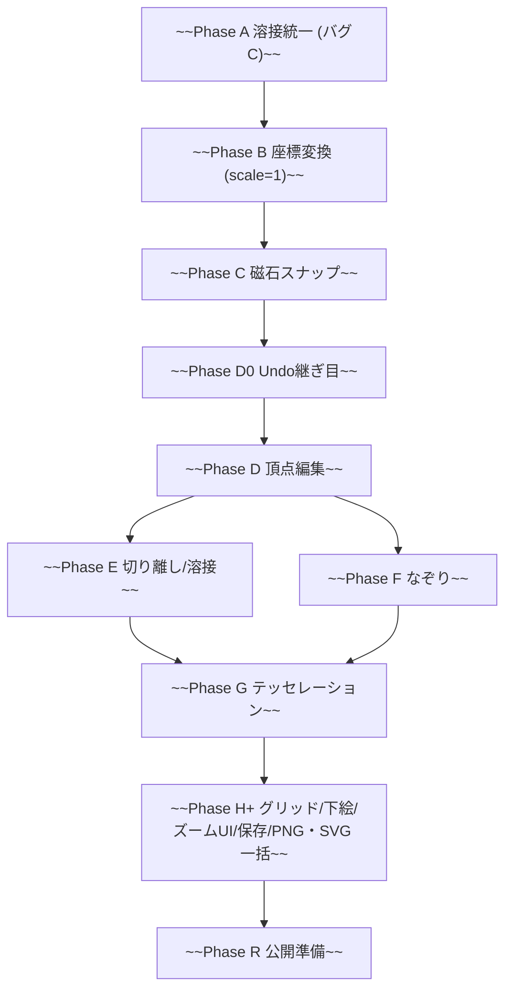
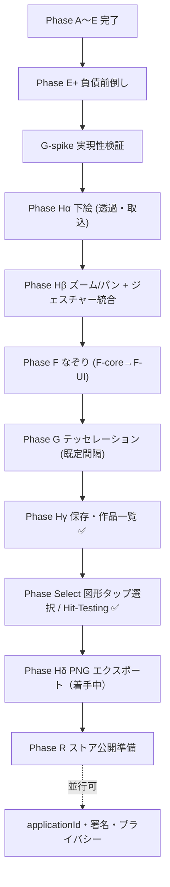

# polygon_art_app 開発計画（再設計版・マスター）

> リリース予定: 本アプリは **Google Play で正式リリース予定**。したがって「とりあえず動く」ではなく、拡張性・保守性・製品品質（下記「リリース要件」「品質方針」、詳細は [plan_future_phases.md](plan_future_phases.md) の「コード品質・修正前提」）を満たす前提で実装する。収益化は **広告のみ**（v1 はバナー最小、リリース後にリワードで解放）。**課金（IAP）は現時点では実装しないが、将来追加できる可能性は残す**（エンタイトルメントの継ぎ目を汎用に作る）。

実機テストで方針が当初計画からズレたため、コアを組み直す。この計画は既存の [.cursor/plans/polygon_art_開発計画_a355081f.plan.md](.cursor/plans/polygon_art_開発計画_a355081f.plan.md) を上書きする最新版。

> **本ファイルの位置づけ（2026-07-14 分割）**: 元は本ファイル1本（902行）に全フェーズ詳細・検討メモを集約していたが、開発チャットでのトークン消費を抑えるため以下の3ファイルに分割した。**本ファイルは全体地図（マスター）**であり、フェーズ別の詳細仕様・技術的負債表・検討メモは含まない。
>
> - **本ファイル（マスター）**: 概要・確定した設計判断・品質方針・実装順序（全体地図）・リリース要件・v1.0出荷ライン・不確定要素・Git運用のみ。
> - [.cursor/plans/plan_phase_H_delta.md](.cursor/plans/plan_phase_H_delta.md): **現在着手中の Phase（Hδ: PNG エクスポート）** の詳細仕様・着手前チェックリスト・関連テスト・直近の検討メモ。着手フェーズが進んだら、次フェーズの詳細に中身を差し替え、**ファイル名も次フェーズ名にリネーム**して使い続ける運用とする（例: `plan_phase_Select.md` → `plan_phase_H_delta.md`、2026-08-09 実施）。
> - [.cursor/plans/plan_future_phases.md](.cursor/plans/plan_future_phases.md): 未着手フェーズ（R）の詳細仕様、コード品質・技術的負債表、テスト方針、リスクと対策。
> - [.cursor/plans/plan_archive_history.md](.cursor/plans/plan_archive_history.md): 完了済みフェーズ（A〜E+、G-spike、Hα、Hβ、F、G、Hγ、Select）の実装済み仕様と、過去の検討メモアーカイブ（2026-07-17 新設、コンテキスト肥大化防止のため `plan_future_phases.md` から分離）。
>
> **運用ルール（継続）**: 議論の経緯・決定理由は該当ファイル末尾の「検討メモ」に日付付きで積み上げる（直近は `plan_phase_H_delta.md`、過去は `plan_archive_history.md` が正本）。単純な情報追加は各 Phase の節に直接追記してよい。既存の決定そのものを明確に覆す場合のみ、その行を削除せず ~~取り消し線~~ を引いて残し、検討メモの該当日付エントリを参照させる。関連する検討メモがある節には「→ 検討メモ（日付、ファイル名）参照」の一行リンクを添える。
>
> **着手用サマリ**: [.cursor/plans/plan_phase_H_delta.md](.cursor/plans/plan_phase_H_delta.md) 冒頭の **現在のステータス** に Phase・完了条件・次ステップを置く。新チャット・AI 着手時は `@plan_phase_H_delta.md` を付ける。Phase 完了コミット後に **現在のステータス** を更新。仕様の詳細は `plan_phase_H_delta.md`（現在フェーズ）／`plan_future_phases.md`（未着手フェーズ）／`plan_archive_history.md`（完了済みフェーズ・過去ログ）が正本、本ファイルは全体地図。frontmatter の `overview`（先頭 YAML 4行目付近）は Plan 用1行要約。

## 確定した設計判断（前提）

- 目的: 絵が苦手な人でも「それっぽい」ポリゴンアートが作れる（点打ち／なぞり／〇→自動分割）。下絵をなぞって隙間なく敷き詰め、後から座標編集できる。
- データモデル: 重なる点は同じ `Vertex` を共有する「溶接（weld）」に一本化。描画・クローズ・磁石吸着すべて「近い既存頂点の ID を再利用」。
  - 「描画は ID 共有／クローズは座標コピー」という現行の非対称ルールは廃止。
- 切り離し（detach）は後フェーズで専用機能として追加（既定は溶接）。
- 座標変換の「継ぎ目」を前倒し（拡大率=1 で先に土台だけ）。当たり判定半径は画面 px を `/scale` してワールド換算。
- 自動テッセレーション: 三角メッシュのみ・既定は幾何学ローポリ。点分布は差し替え可能な部品にして、均一モザイクや四角は将来オプション。一つずつ実装。

## 品質方針

- **早くリリースより、破綻しない・シンプルなコードでリリース**を優先する。「とりあえず動く」で Phase を飛ばさず、各段階で実機確認してから次へ進む。
- **維持する核**: 溶接モデル（共有頂点プール）、座標変換の数学的継ぎ目（`ViewportTransform`）、transient/committed 分離、テスト文化。大規模リファクタや Notifier の乱立は避ける。
- **シンプルさ**: `CanvasNotifier` を複数 Notifier に分割しない。代わりに **純関数の抽出**（`geometry/` / `services/`）で責務を切る。DI フレームワークは入れない。
- **Phase 完了条件**: `flutter analyze` / `flutter test` に加え **実機確認**、および [plan_future_phases.md](plan_future_phases.md) の「コード品質・修正前提」の該当チェック項目を満たすこと（→ 検討メモ 2026-07-13、[plan_archive_history.md](plan_archive_history.md) 参照）。
- **コミット**: Phase 完了＝1コミット（実機OK後）。同一ファイルに複数 Phase が載るときは無理に分割しない（→「Git / コミット運用」節）。

## 戻りを最小化する実装順序

体験が早く揃う順。下絵＋ズームは G より先（「写真をなぞってローポリ化」が v1 の芯）。→ 検討メモ（2026-07-13、[plan_archive_history.md](plan_archive_history.md)）参照。

### ~~旧フロー（2026-07-13 前）~~

~~A→B→C→D0→D→E の後、F と G を経て、下絵・ズーム・保存等を **Phase H+ に一括** で接続。~~

### 現行フロー（2026-07-13〜）

**並行メモ**: G-spike は Hα より前に **0.5〜2日** で de-risk。**完了済み（2026-07-15、Go・Tier B確定）**。Hα・Hβ・F・G・Hγ・**Select 完了（2026-08-09）**。Phase Hδ を現在着手中へ引き込み。Phase R の applicationId・署名・プライバシーは Hδ 前後に並行推奨。

**v1.1 以降（初回見送り）**: G 粗さスライダー、スポイト、グリッド、SVG、リワード広告、Redo 永続化、下絵自由変形、設定画面本格版、豪華チュートリアル、グラデ等の彩色仕上げ（タップ選択・彩色最小入口は Phase Select へ移管済み）。

### Phase × 主要タッチポイント

| Phase | Artwork モデル | canvas_provider / canvas | 永続化 | 実機必須 |
|-------|----------------|--------------------------|--------|----------|
| E+ | 間接（Undo） | 小 | なし | 否 |
| G-spike | 紙上（U1） | なし | なし | 否 |
| Hα | UnderlayLayout 追加 | 小 | なし | 是 |
| Hβ | なし | **大**（ジェスチャー） | なし | 是 |
| F | draft 操作 | 中 | なし | 是 |
| G | polygons 大量追加 | **大** | なし | 是 |
| Select | なし（選択は session） | **中**（ヒット／ターゲット） | なし | 是 |
| Hγ | **ArtworkDocument 分離** | 中 | **新規** | 是 |

→ 検討メモ（2026-07-14 追記続き4、[plan_archive_history.md](plan_archive_history.md)）参照。

### 改定済み frontmatter todos（旧文言）

- ~~`phase-f-trace`: なぞりモード(TracePointGenerator・等間隔生成・近接頂点と溶接)を実装~~ → 現行は F-core/F-UI 分割・`commitTraceStroke` 契約参照
- ~~`phase-g-tessellation`: 輪郭→点分布→ドロネー（粗さスライダー含む完了条件）~~ → 現行は既定間隔のみ・G本番直前ゲート参照
- ~~`phase-h-rest`: グリッド/下絵/ズームUI/保存/PNG・SVG を H+ に一括~~ → 現行は Hα/Hβ/Hγ/Hδ に分割

---

## リリース要件（横断・製品化）

機能フェーズ（A〜G）と並行して満たす、製品として出すための横断要件。★は「後から入れると作り直しになる」ため早期に土台を用意する。

- データ範囲: 作品データは**端末内のみ・アカウント無し・自前クラウド無し**。SNS共有は OS の共有シート経由で書き出し画像（PNG/SVG）を渡すだけ（`share_plus`）。あなた側の通信は**広告のためだけ**。
- ★保存の互換性: 保存JSONに `schemaVersion` を持たせ、`v1→v2…` のマイグレーション関数を用意。フェーズで項目が増えても**旧作品を壊さない**。最初の保存実装から入れる。
- ★Undo/Redo: 機能ごとに個別実装せず、**汎用の履歴スタック**で一元化（現在の `undoLastVertex` を置き換え/内包）。基本の継ぎ目（Undoのみ・スナップショット方式）は Phase D0 で前倒し、Redoと永続化統合は Phase H+ で追加。
- ★自動保存・復帰: デバウンス自動保存＋アプリ休止時保存＋アトミック書き込み（temp→rename）で、kill されても作品を失わない。
- 性能予算: テッセレーションで三角形が数千枚になり得るため、描画と当たり判定（現在は全頂点 O(n) 走査）の負荷を監視。必要になれば空間インデックス導入を検討（頭出し）。
- 収益化（広告のみ）:
  - v1 は **AdMob バナーのみ**（ホーム／作品一覧に配置、**キャンバス上には出さない**）。開発中はテスト広告ID、本番で本ID。
  - リリース後に **リワード広告で解放**（保存スロット追加／エクスポート解放）。
  - **エンタイトルメント（無料上限・解放状態・エクスポートtier）を汎用の継ぎ目として v1 で用意**。将来 IAP を足す余地を残す（今回は未実装）。
- 保存スロット/エクスポートの方針:
  - 無料の保存枚数は **10 枚**。上限到達時はギャラリーで「消して空ける」。リリース後にリワードでスロット追加。
  - 無料エクスポートは標準PNG。**プレミアム（透かし無し／高解像度／SVG）はリリース後にリワードで解放**。無料エクスポートに透かしを入れるかは Phase H のエクスポート実装時に決定。
  - 後から上限を締めると反発を招くため**上限モデルは今固定**。既存の保存済み作品は後の仕様変更でロックしない（救済）。
- コンプライアンス（広告に伴い必須）: プライバシーポリシー公開、Play「データ安全」申告（広告SDKの収集内容）、EEA/UK向け同意（Google UMP）、対象年齢は一般向け（13歳以上）。

## v1.0 最小出荷ライン

> 一言: **写真やイラストを下絵にして、拡大しながらなぞり、自動で三角ローポリにし、編集・保存・PNG共有できる Android アプリ**。→ 検討メモ（2026-07-13、[plan_archive_history.md](plan_archive_history.md)）参照。

### v1.0 に入れる

| 領域 | 内容 |
|------|------|
| 済（A〜E） | 溶接・描画・磁石・Undo・頂点編集・detach/weld・座標継ぎ目 |
| E+ | Undo上限・weld figure-8・不足テスト（#5,#7,#15,#16） |
| G-spike | ドロネー/パッケージ選定・代表閉曲線1つの三角化検証 |
| Hα | 下絵（ギャラリー・透過・ON/OFF・フィット固定） |
| Hβ | ズーム/パン（2本指ピンチ＋パン、「全体表示に戻す」） |
| F | なぞり（F-core + F-UI、タップ/なぞり切替） |
| G | テッセレーション（**maxEdge/minEdge 固定・UI1ボタン**＝目玉。world 値は G 着手前に相談で確定） |
| Select | 図形タップ選択（Hit-Testing）＋彩色最小入口（Hγ 前／並行・2026-07-27 前倒し） |
| Hγ | 保存・作品一覧・自動保存・下絵アプリ内コピー・`schemaVersion` |
| Hδ | PNG 書き出し（下絵なし出力で可） |
| UX | **簡易オンボーディング**（初回3ステップ or エディタ常時ヒント1行） |
| I | **統合 smoke**（9ステップ通し + kill 復帰。Hγ 完了時・R QA 前にフル実行） |
| R | applicationId・署名・プライバシー・UMP・AdMobバナー（ホーム/一覧のみ）・QA |

### v1.0 見送り（v1.1 以降）

- G 粗さスライダー、スポイト（下絵から色取得）、グリッド、SVG、高解像度/透かし、リワード広告、Redo/Undo 再起動後保持、下絵の自由変形、設定画面本格版、IAP（エンタイトルメント継ぎ目のみ v1 で用意）、豪華チュートリアル、グラデ等の彩色仕上げ
- ~~任意図形のタップ選択（Hit-Testing）~~ → **Phase Select へ前倒し（2026-07-27）**

### ストアで見せる体験の一本道

1. 新規作成 → 2. 写真を下絵 → 3. ピンチで拡大 → 4. なぞり → 5. 輪郭を閉じる → 6. 自動三角ローポリ（目玉）→ 7. 編集 → 8. 自動保存 → 9. PNG 共有

---

## 不確定要素とクリア期限

v1 完成直前の停滞を避けるため、以下を「未確定」と明示し **いつまでに決めるか** を Phase ゲートに紐づける。→ 検討メモ（2026-07-14 追記続き4、[plan_archive_history.md](plan_archive_history.md)）参照。

| ID | 不確定要素 | リスク | クリア期限（ゲート） | 成果物 |
|----|-----------|--------|---------------------|--------|
| U1 | `ArtworkDocument` v1 スキーマ | Hγ で大規模リファクタ | ~~G-spike 完了時~~ → **✅ 完了（2026-07-15、紙上設計 Go）** | フィールド一覧（紙上可） |
| U2 | 統合 smoke の Pass/Fail | Hγ/R で手動 QA 爆発 | **Hγ 着手前（草案）／R QA 前（フル実行）** | smoke チェックリスト |
| U3 | Hβ・G の実工数 | 後半スケジュール破綻 | **各 Phase 着手時** | 見積もり1行（検討メモ） |
| U4 | 失敗系（破損JSON・権限拒否等） | リリース品質 | **Phase R QA 前** | #19 手動確認 |
| U5 | **`maxEdge` / `minEdge` の world 値** | G の見た目・枚数が破綻 | **G 本番着手前（実機相談）** | 定数値 + 検討メモ1行 |

※ v1 未リリースのため A〜F の変更は「ユーザーデータマイグレーション」ではなく **リファクタコスト** として扱う。
※ API 課金（Cursor 等）・長期 OS メンテ方針は **本計画のスコープ外**（リリース後に別途運用メモでよい）。

## Git / コミット運用

- **基本**: 各 Phase 完了時に **1コミット**（コミットメッセージに Phase 名を明記）。
- **タイミング**: `flutter analyze` / `flutter test` 通過に加え、**その Phase の実機確認が終わってから**コミットする（マイルストーンコミットは実機OK後）。E+ / G-spike はロジックのみなら実機不要。
- **分割の判断**: 複数 Phase の変更が同一ファイル（例: `canvas_provider.dart`）に重なっている場合は、無理に Phase ごとに分割しない。2〜3コミットへのまとめ、または1コミットを **実装前に提案** する。
- **計画メモ**: Phase 完了時は該当ファイル末尾の検討メモに実装・実機結果を追記してからコミットしてよい。
- **CI（推奨）**: push/PR 時に `flutter analyze` + `flutter test` を GitHub Actions 等で実行。フル回帰の自動化はユニット/ロジック層に限定し、統合 smoke は上記手動 checklist（U2）でカバーする。

> 経緯・例外の詳細は検討メモ（2026-07-12、[plan_archive_history.md](plan_archive_history.md)）参照。
